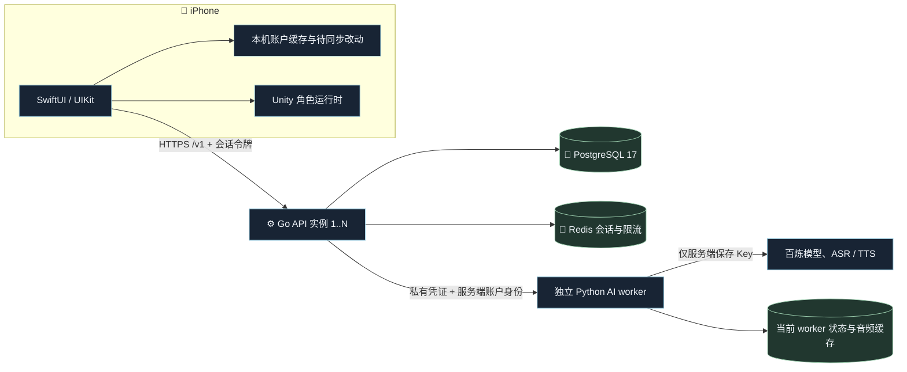

# 星夜账户平台：架构与数据边界

初版日期：2026-09-30。接口主版本：v1。2026-10-02 路由升级为 Gin/Huma，新增账户安全、反馈与 OSS 内容交付基础；当前补充设计见 [账户与角色内容交付](design/account-and-assets-2026-10-02.md)。历史迁移描述保留。

## 项目拆分

账户 API 位于本仓库根的 `cmd/`、`internal/`，独立 Python AI 位于 `services/character_ai/`；所有部署、快照和服务端维护工具位于 `scripts/`。客户端 iOS/Unity、资源包制作和受限角色资产属于另一个 `starrynight` 仓库，不是服务端的编译或运行依赖。

2026-10-01 只搬迁原实现，保留 PostgreSQL、Redis 与原 AI 机制。接口、流事件、数据模型保持兼容；Go module/import 前缀更新到独立仓库。未引入新的 Web 框架或数据库架构。详细迁移边界见 [仓库拆分](repository-separation.md)，当前部署状态见 [迁移记录](server-migration-2026-10-01.md)。

Go 当前采用按业务划分的模块化单体，账户写入需要一个事务时可以直接完成，不引入跨服务分布式事务。进程不保存权威用户资料或本机会话表；API 实例共享 PostgreSQL 和 Redis，方便按流量水平扩容。聊天推理的容量独立于账户 API 的容量。

## 数据归属

| 业务数据 | 权威位置与隔离键 | 本轮接口/行为 |
| --- | --- | --- |
| 登录账号与密码 | `users`；内部 UUID | 大小写规范化账号、Argon2id 密码，登录/改密/注销 |
| 外部登录身份 | `identities(provider, subject)` → user | 已预留唯一约束；微信/手机号的真实绑定和验证尚未接入 |
| 昵称、头像、简介 | `users.profile` | GET/PATCH `/me`；私有账户 ID 不作为公开作者 ID |
| 主题、样式、字号、最近角色 | `settings(user_id)` JSONB | GET/PATCH `/me/settings` |
| 每角色音量、音乐、取景状态、偏好、问候状态 | `preferences(user_id, character_id)` | 合并更新；角色之间和账户之间隔离 |
| 作者名、简介、公开头像 | `authors`，单独 public ID | 自己修改，公开读取，关注人数来自真实关系 |
| 角色订阅 | `subscriptions(user_id, character_id)` | 与作者关注是两套独立关系；重复订阅不重复计数 |
| 作者关注 | `follows(user_id, author_id)` | 可取消、分页，不能关注自己 |
| 用户创建的角色与发布状态 | `characters.owner_id`、`author_id`、`base_id` | private/public/unlisted；私有条目只允许主人读取和修改 |
| 消息列表“不显示”、置顶 | `conversations(user_id, character_id)` | 隐藏不删消息；新消息重新显示 |
| 聊天正文与结构化 AI 脚本元数据 | `messages(user_id, character_id, UUID)` | UUID 幂等保存、分页、文本搜索、明确清空 |
| 手动记忆、共同片段 | `entries(user_id, character_id, kind, UUID)` | 修改版本校验、删除墓碑、删除后旧版本不能重新创建同 ID |
| 数据变更与恢复游标 | `account_clocks` + `changes` | 每账户提交有序的同步流；分页导出不包含密码或服务 Key |
| 人物包、贴图、PCM、临时截图 | 设备包/现有 worker 文件缓存 | 不塞进 JSONB；未来独立对象存储与资源清单，不假装本轮已经上传 |

“记忆”包括当前客户端确认保存的资料；Python worker 的推理关系状态、调用账本、音色记录及音频缓存仍属于原有 AI 服务，这轮没有把它们冒充为已经迁移到 PostgreSQL。新平台账户通过稳定的服务端 UUID 访问同一 worker 命名空间，跨设备不再由客户端安装 ID 决定。旧本机体验账号使用原开发入口，保留原数据；不会自动合并到任意正式账户。

## 成熟组件与选择理由

| 组件 | 用途与决策 |
| --- | --- |
| Go + Gin | HTTP 并发和路由；无需 Java，不自制框架 |
| Huma | Go 类型对应参数验证、错误响应和 OpenAPI；[官方配置与 OpenAPI](https://huma.rocks/features/openapi-generation/) |
| pgxpool | PostgreSQL 驱动、事务与连接池；明确 SQL 的所有权条件和查询计划 |
| Goose | 版本迁移与迁移锁；API 启动不自行竞争 schema 升级 |
| SCS + goredisstore | 不透明、可撤销会话，避免自行设计 JWT 刷新协议；[SCS 官方仓库](https://github.com/alexedwards/scs) |
| argon2id | 成熟的密码哈希实现；每实例限制昂贵哈希并行数 |
| go-redis + redis_rate | 所有 API 副本共享限流状态，Redis 故障时拒绝绕过鉴权 |
| json-patch | RFC 7396 合并，保留旧客户端不理解的字段 |
| Prometheus client | 固定路由标签的延迟和进程指标，避免账户 ID 高基数标签 |
| Go ReverseProxy | SSE/WebSocket 转发、上下文取消；使用 Rewrite 明确替换身份和凭证，[官方接口](https://pkg.go.dev/net/http/httputil#ReverseProxy) |

查询设计参考 Supabase 官方 [PostgreSQL best practices 技能](https://github.com/supabase/agent-skills/tree/main/skills/supabase-postgres-best-practices)：游标分页、与谓词匹配的索引、连接池和短事务。没有为套用技能引入 Supabase 托管服务或不需要的 SDK。

## 账户与认证

注册分配 UUIDv7，公开作者 ID 独立生成。密码从不明文入库；SCS 令牌存 Redis，手机存 Keychain，且按服务器地址隔离。会话最长 30 天，可主动刷新。每次认证同时检查 PostgreSQL 的 `session_epoch`；改密码后旧设备令牌立即失效，注销后用户不存在也不能继续使用原令牌。

测试游客是服务端显式开关，并非固定万能测试密码。不同游客拥有不同账户和默认订阅；原地注册保留 UUID。`STARRY_ENV=production` 与 `ALLOW_TEST_GUEST=true` 同时出现会拒绝启动。测试中仍可不登录浏览现有本机角色；账户同步需要正式或测试游客会话。

客户端传来的 `X-Starry-Account`、作者 ID、owner ID 都不能决定服务端的数据访问。SQL 写入和私有读取始终使用会话主体。AI 代理仅允许状态、对话、音频重播、ASR 路由；不能代理管理、付费音色设计或任意 URL。Go 与 AI worker 的共享凭证不下发到正式客户端。

## 同步与兼容

一次写操作先锁该账户的 `account_clocks` 行，再在同一事务内更新资源、增加 revision、记录完整事件。不同账户可以并行。没有直接用全局 sequence 当同步游标，因为先分配的小 sequence 可能后提交，客户端会漏掉晚提交的数据。

资源更新传 `expected_version`；不相同返回 409，客户端拉取并比较“上次确认、本机现在、服务端新值”。双方都改过就保留本机和云端版本，账户页提供“保留本机副本，采用云端版本”，先写保护副本再覆盖。没有过期网络响应跨账户回写；每次 await 后检查账户与取消状态。

本机缓存与上次确认快照形成可重建的待发送队列。修改先落盘；900ms 合并普通变更，失败后最多五次退避重试，回到前台或手动同步可继续。拉取一页时合并写一次本机文件；写盘失败回滚本页，不推进游标。远端原值的重复确认不能覆盖尚未发送的本地变化。清空消息删除活动正文与历史消息事件，再写一个有序清空标记；隐藏会话保持全部记录。

列表使用游标而不是大 OFFSET，条数上限 200；同步页同时限制约 1 MiB 事件正文，避免大账户一次返回整份聊天史。搜索对 LIKE 元字符转义，并使用 PostgreSQL trigram 索引。高频用户状态写入按账户串行，这是保证同步顺序的有意取舍；不同账户并行，不是全系统一把锁。

兼容规则：

1. `/v1` 内优先新增可选字段和能力。`schema_version` 表示文档结构，`version` 表示资源 CAS 版本，`revision` 表示账户变更位置，三者不可混用。
2. JSONB 的扩展放在稳定命名空间中。PATCH 仅发送变化，未知字段要往返保留；`null` 的删除语义由 RFC 7396 定义。有限枚举改变语义时增加新字段或新接口，不假设老 App 一定能处理新枚举。
3. 数据库先添加兼容列/表，再部署双读或迁移，再切换写入；删除字段最后做。发布前运行旧请求与新请求契约回归。
4. 不兼容的身份、同步或协议变更使用新 API 主版本，并保留明确支持窗口。不能保证所有尚未考虑的未来场景零迁移成本。
5. 变更流当前不按时间过期。未来要压缩时，必须先提供快照和 `min_cursor`/游标失效恢复协议；不能直接清掉旧日志让离线设备静默漏数据。用户主动清空和注销属于删除语义，允许事件游标出现空档。

## 并发、上线与现阶段边界

默认每实例 16 个数据库连接，有超时、回收和随机寿命；使用无命名预编译状态的执行模式，后续可接事务池。上线时满足 `副本数 × pool size + migration/运维连接 < PostgreSQL 可用连接数`，再根据真实负载调整。密码哈希默认每实例最多两个并行，避免登录流量耗尽内存；额外请求返回可重试的 429。

API 使用就绪/存活探针、优雅退出、请求 ID、固定维度指标。多实例不依赖粘性会话。生产连接要求 PostgreSQL 验证 TLS 和 Redis TLS；数据库、Redis、metrics、worker 都应处于私网，由入口代理终止 App 的 HTTPS。当前按真实 TCP 对端进行 IP 限流，不信任任意 `X-Forwarded-For`；若前面增加公网网关，需按已知代理网段设计可信客户端地址和网关限流。

这套结构具备横向扩容条件，**没有未经测试的百万并发或 QPS 承诺**。测试中两个 API 实例共享真实 PG/Redis，覆盖多账户读写及 CAS 冲突；`TestReplicaWorkload` 会输出受控负载的延迟与吞吐，实际是否执行见验证记录。

当前 AI worker 仍有单进程 SQLite、文件缓存、四个活跃推理的边界；复制 Go 实例不会让付费模型或 worker 自动扩容。AI 的下一阶段需要独立迁移状态、对象存储、共享预算/任务并发和观测，再扩大推理副本。当前在册角色可以沿用现有协议；用户创建实例的资源继承与独立推理音色还须进一步对齐 worker 的在册角色协议。

初始账户实现未接入微信开放平台、短信服务、邮件找回密码、付费订阅/购买、内容审核或大文件上传。角色的“发布”目前是服务端目录可见性，不代表已经建立资源商城交易或拥有任何模型再分发权。原生发现页缓存首批 100 个目录项，并单独补齐已订阅角色；服务端搜索与分页已齐备，移动端完整远程翻页仍需后续接入。账户注销清理 Go 平台数据；原 worker 的历史状态与音频还需要独立清理联动，不能把平台注销描述为所有系统数据已彻底删除。
