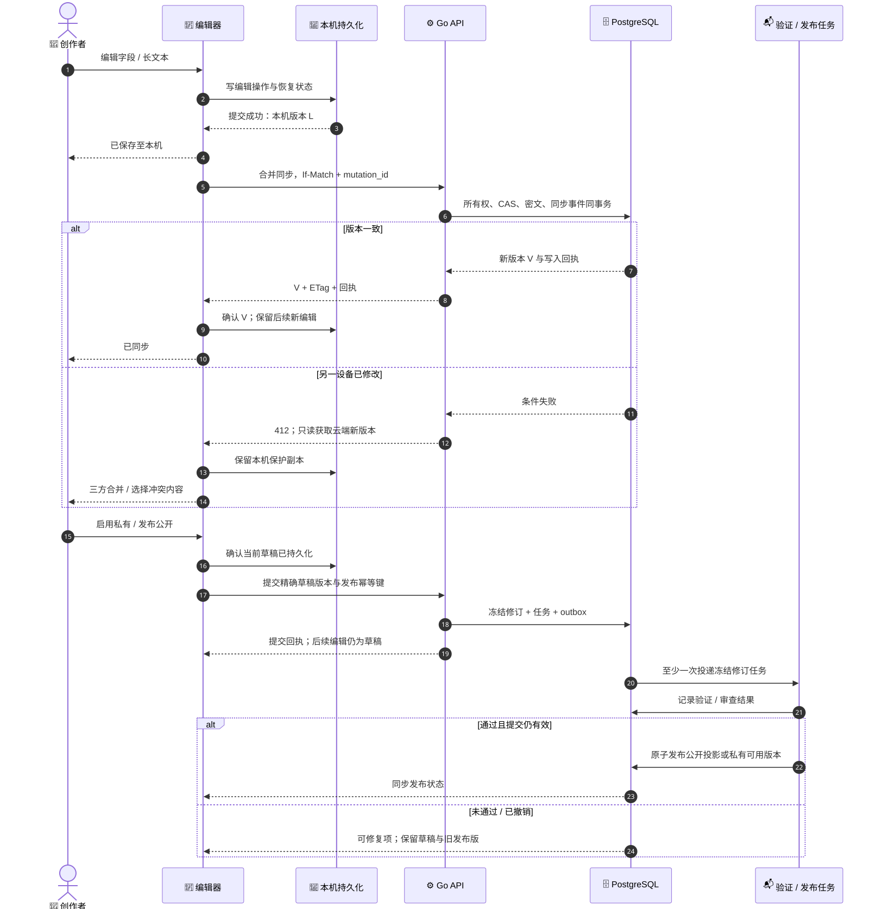

# 星夜设定平台与独立对话实例：服务端技术方案

日期：2026-10-04。状态：设计提案，未增加业务实现、依赖或数据库迁移，未部署。设计对应客户端[产品及创作方案](https://github.com/gukaifeng/starrynight/blob/main/docs/design/2026-10-04-setting-creation-and-publication.md)，并接续角色/设定拆分与发现双入口方案。本文是服务端技术设计的权威文件；源码与部署始终位于本仓库。

## 1. 当前实现与重构边界

只读检查确认：

- HTTP 层为 Gin/Huma，PG 为账户平台权威库，Redis 提供 SCS 会话与分布式限流，Caddy 提供公网 HTTPS。模型资源已有 OSS 清单与临时签名。
- characters 目前包含用户创建的角色副本；客户端中央加号调用 CreateCharacterPage，部分文案还保留“没有服务器”的旧描述，需要随新编辑器一起替换。
- PG conversations、messages、entries、conversation_goals 按 user_id + character_id 组织。Python storage.py 又维护 owner + character 的 SQLite 消息、请求、记忆、候选和灵感接话。
- 角色 profile 与场景/语言混合，worker 从本地 PROFILES 解析；直接新增设定表不能让现有所有触发正确进入独立玩法。
- Go 文档合并当前限制 64 KiB，全局 API 请求体默认 256 KiB；长设定草稿需要独立合约和路由限额，不能复用账户偏好接口硬塞。
- 客户端已有分段翻译、原文摘要缓存和灵感建议翻译；应升级作用域，保留呈现组件。
- 管理平台位于 admin-web/ 与 internal/admin/，需要增加设定发布和分层源稿权限，不能通过通用 JSON 编辑器覆盖私有发布版本。

可以大改内容域、实例域和 worker 状态边界；保留已验证的账户身份、可撤销登录会话、数据库、媒体资源及情绪表演标准。未发版降低客户端兼容负担，但不能删除正在测试的真实用户记录、音频和模型资源。

## 2. 架构与组件

采用模块化 Go API 与可独立扩容的任务/AI worker，不为每个领域立即建立微服务。对外只开放账户/内容/对话 API 和独立管理入口；PG、Redis、队列、解密、worker 与内部回调都不对客户端开放。

| 层 | 决策 |
| --- | --- |
| API | 保留 Gin/Huma；定义 v2 内容与实例 DTO、OpenAPI 和错误协议 |
| 数据 | 保留 pgxpool + PostgreSQL、Goose；短事务、外键、版本检查和所有权条件 |
| 会话 | 保留 SCS + Redis、session_epoch；不改成自制 JWT 刷新系统 |
| 内容合约 | JSON Schema 2020-12；拟用 santhosh-tekuri/jsonschema/v6 做作者内容校验，新增前验证锁定版本 |
| 匹配 | 有类型规则树 → 受控 CEL，拟用 cel.dev/cel-go；权限另行检查 |
| 后台投递 | 拟用 Asynq + 既有 Redis 做有界重试/队列；PG outbox/job 账本为可重建来源 |
| AI 执行 | 保留 Python 供应商适配与流式/TTS/ASR 能力，移除其独立权威聊天 SQLite |
| 对象 | 保留 OSS SDK；模型、图、背景、音频对象与 DB 元数据分离 |
| 私有正文 | 单独表及信封加密；标准 AES-GCM/KMS 密钥引用，密钥不与密文同库明文保存 |
| iOS 草稿 | 拟用 GRDB.swift + SQLite 单连接写队列；不以 UserDefaults 存长文，不等待云端才保存 |
| 观测 | 继续既有语音 traces/Prometheus，增加保存、发布、匹配与缓存阶段 |

依据：[JSON Schema](https://json-schema.org/draft/2020-12)、[Go JSON Schema 实现](https://github.com/santhosh-tekuri/jsonschema)、[CEL Go](https://github.com/cel-expr/cel-go)、[Asynq](https://github.com/hibiken/asynq)、[GRDB](https://github.com/groue/GRDB.swift)。以上新增项是选型，当前 go.mod、Swift 包和部署配置均未改变。

## 3. 领域对象与版本

| 对象 | 标识 | 可变性与职责 |
| --- | --- | --- |
| CharacterDefinition | 保留现有 character_id | 稳定人物身份、作者、发布头指针 |
| CharacterRevision | character_id + revision | 不可变固定资料/人格/声音与能力快照 |
| CharacterAssetRelease | 平台、release_id、哈希 | 已编译模型与原始能力；多个实例共享 |
| SettingTemplate | setting_id UUID | 稳定作品、作者、访问属性、发布头及 access_epoch |
| SettingDraft | draft_id UUID + draft_version | 单作者可变编辑源稿，允许未完成、未解析的表单值 |
| SettingRevision | setting_id + revision | 冻结的公开/运行/条件/参数/开场内容及摘要 |
| SettingSubmission | submission_id | 精确修订的启用/公开申请、验证/审查状态 |
| SettingRelease | release_id | 已验证可使用的版本及发布记录，不原地编辑内容 |
| CharacterSettingBinding | 精确角色/设定修订及参数范围 | 专属开场、人工适配或禁用，不存用户进度 |
| ConversationInstance | conversation_id UUID | 用户的具体相处、版本快照、参数、关系/任务、代次 |
| PreparedCandidate | prepared_id UUID | 对应实例/触发/快照的单个已准备候选 |

四种“版本”不可混用：schema_version 是格式；draft_version 是编辑 CAS；content revision 是作品发布内容；config_version/reset_epoch 是实例状态/重置。角色能力、表演协议、编译器、声线各有独立修订。

作者修改已发布作品时，从指定修订生成草稿，再发布新修订；同一修订的源稿不可变。模板的当前可见性/访问权是另一个即时检查，不因旧实例钉住版本就绕过撤销。

人物 identity.height_cm 是作者的剧情属性，缺失为未知；不从 runtime 模型高度推导。允许用户调整的取景、音量、氛围始终存偏好，不纳入固定身份。

## 4. 合约与编译输入

源稿包含 public_profile、runtime、compatibility、parameter_schema、opening_policy、media_refs、extensions。public_profile 与运行内容的对应摘要是服务器显式投影；不把 public_profile 的介绍自由文本再次当作高优先级指令。

下例仅示范字段划分，使用虚构模板、公开示例文字；不代表现有角色数据或已实施 API：

~~~json
{
  "schema_version": 1,
  "public_profile": {
    "primary_locale": "zh-Hans",
    "title": "雨夜的英语书店",
    "synopsis": "在书店里自然聊天，顺便练习英语表达。",
    "experience": "先回应意思，再轻轻给出一个更自然的说法。",
    "cover_asset_id": null
  },
  "runtime": {
    "scene": {
      "location": "a quiet bookshop on a rainy evening",
      "event": "the user arrives to talk about a book",
      "initial_relation": "new_acquaintance"
    },
    "goals": {"primary": "task", "secondary": ["companionship"]},
    "language_policy": {
      "default": "en",
      "allowed": ["en"],
      "thought_language": "dialogue",
      "allow_mixing": false
    },
    "blocks": {
      "teaching-rule": {
        "kind": "instruction",
        "purpose": "teaching",
        "text": "Respond to the meaning before offering one concise correction."
      }
    },
    "block_order": ["teaching-rule"]
  },
  "compatibility": {
    "required": {"all": [
      {"field": "capabilities.spoken_languages", "op": "contains_all", "value": ["en"]}
    ]},
    "preferred": []
  },
  "parameter_schema": {
    "level": {"type": "enum", "values": ["A2", "B1", "B2"], "default": "B1", "change_policy": "in_place"}
  },
  "opening_policy": {"mode": "three_authored_candidates"},
  "media_refs": {},
  "extensions": {}
}
~~~

完整启用版本另需三组开场及必需元数据；示例不用于发布。UI form_schema 是服务器发布的受控表单描述：字段类型、标签/帮助、必需性、展示条件、长度和分组。不能把别人写的 JSON Schema/URL 直接下载执行。

草稿合约保存 raw_fields、有效的 normalized_document 和 field_errors；原始编辑优先，不能因数值暂时输入“-”或中文输入法未提交而删内容。保存草稿只做安全结构、大小及类型封装检查；启用/发布才做语义、能力、变量和编译预算检查。

发布验证至少包括：允许字段/命名空间、唯一块 ID 与引用、初始关系及人物边界、数值单位与逻辑可满足性、语言能力、参数变更策略、必需资源、开场三组、输出协议、许可及至少一个适用人物。未来未上架角色的定向作品先留草稿。

格式校验用 JSON Schema；业务语义和权限不能只靠 Schema。schema refs 固定在服务器注册表，不开放网络解析。optional 扩展往返保留；required_features 未支持时拒绝进入，未知字段不静默成为指令。

限额草案：压缩前编辑正文不超过 512 KiB，单文本块不超过 64 KiB，块不超过 128 个，规则深度不超过 8、节点不超过 128。路由单独配置请求/解压上限，不能绕过网关限额。数字都是待测可配置默认值，不是模型上下文容量。

发布再估算真实供应商模型的输入 token：平台 + 固定角色 + 当前设定 + 必需状态 + 最近历史 + 输出预留。静态设定占用预算按模型配置，建议上限不超过可用上下文的一部分；精确比例在供应商锁定能力与验证后确定。超预算定位到章节，禁止静默裁掉硬规则或秘密披露条件。可选背景分块按明确规则取用；未来知识检索独立接入，不默认增加付费 embedding 调用。

## 5. PostgreSQL 模型与索引

下表是拟新增/演进表，具体 Goose SQL 在实施时生成，不运行文档中的设计描述。

| 表 | 核心列 | 约束与主要索引 |
| --- | --- | --- |
| character_revisions | character_id, revision, public_core, capability_snapshot, private_ref, hashes | PK(character_id, revision)；已发布行不可改源内容 |
| setting_templates | id, owner_id, author_id, visibility, availability, access_epoch, current_release_id, version | owner/author/recent 索引；owner 来自会话，不信任 body |
| setting_drafts | id, owner_id, template_id, base_revision, version, source_ciphertext, crypto_metadata, schema_version, updated_at, deleted_at | UNIQUE(owner_id,id)；owner/recent；软删除墓碑与精确 CAS |
| setting_draft_checkpoints | owner_id, draft_id, checkpoint_id, version, ciphertext, created_at | 复合 owner FK；有界保留并跟随删除策略 |
| setting_revisions | setting_id, revision, public_document, normalized_public_requirements, source_hash, compiler_contract | PK(setting_id,revision)；不可变 |
| setting_revision_secrets | setting_id, revision, ciphertext, wrapped_key, key_id, crypto_version | 独立表/DB 权限；不进入公共 view |
| setting_submissions | id, owner_id, setting_id, revision, target_visibility, validation_status, review_status, report, version | 唯一发布幂等键；只引用冻结修订 |
| setting_releases | id, setting_id, revision, published_at, validation_contract, review_receipt | 只发布审核/验证的那份摘要；head 原子更新 |
| setting_public_projection | setting_id, release_id, title, synopsis, language_summary, requirements_summary, author, cover_ref, search_text | 只由发布模块写；公开列表游标；trigram 索引 |
| setting_favorites | user_id, setting_id, created_at | PK(user_id,setting_id)；不带 private Prompt |
| character_setting_bindings | character/revision, setting/revision, parameter_scope_hash, binding_revision, opening_manifest_ref | 精确复合唯一；只存有实际适配内容的组合 |
| conversation_instances | id, user_id, character_id/revision, setting_id/revision, binding_snapshot, params, config_version, reset_epoch, version, hidden, updated_at | UNIQUE(user_id,id)；owner/recent；owner/character/recent；同组合允许多实例 |
| conversation_turns | id, user_id, conversation_id, client_request_id, request_hash, trigger, status, fence, next_event_seq | UNIQUE(user_id,conversation_id,client_request_id)；同 ID 不同请求体冲突 |
| conversation_messages | id, user_id, conversation_id, seq, turn_id, role, script, delivery_status, source | UNIQUE(conversation_id,seq)；消息 UUID；复合 owner/instance FK |
| conversation_memories / goal_states | user_id, conversation_id, epoch, source_message_id, data, version | 不允许角色 ID 代替实例范围；手动/推断/剧情分源 |
| user_facts / character_preferences | user_id, scope, character_id, allowed_data, version | 真实全局事实需授权；角色称呼优先于全局 |
| prepared_candidates | id, user_id, conversation_id, epoch, trigger, context_hash, status, asset_manifest, expires_at, used_by_turn | owner/instance/trigger；同 slot 活跃候选最多一组 |
| opening_receipts | user_id, conversation_id, epoch, opening_id, message_id, used_at | 每实例/代次的首次开场登记幂等 |
| translations | user_id, conversation_id, epoch, source_kind/id, source_hash, target_locale, contract, segments | 精确唯一，不能跨账号命中私人译文 |
| background_jobs / outbox / mutation_receipts | stable_id, owner/resource, payload_ref, version, status, lease/fence, retry_at | outbox 待投递部分索引；mutation 唯一 owner/resource/id |
| content_audit / review_events | actor_id, action, setting/revision, reason, result, timestamp | 不保存源稿或用户聊天全文；访问与揭示操作分别审计 |

公开检索索引只包含 public projection。筛选需要的固定角色属性由注册字段产生索引/类型列；不能给私有正文全文建公开检索索引。JSONB 不替代 FK、所有权和版本列；大媒体不入 JSONB。

复合外键使 owner 与 instance 保持一致；所有读写 SQL 同时带认证 user_id 与资源 ID。不能因为 UUID 难猜而省权限。单实例 allocate seq 和状态变更用短行锁；同步流继续采用 account_clocks 的提交顺序语义，避免序号先分配后提交导致离线设备漏事件。

draft_version 与 mutation receipt、账号同步事件在同一事务提交。私有变化的普通账户同步 DTO 只给 owner；公共同步事件只有版本/投影。敏感源稿不作为全局事件 payload 明文复制。

## 6. 权限与保密

| 主体 | 公开资料 | 编辑源稿 | 编译完整输入 | 使用者聊天/记忆 |
| --- | --- | --- | --- | --- |
| 未登录浏览者 | 当前公开且可发现的版本 | 无 | 无 | 无 |
| 普通使用者 | 可访问版本 | 无 | 无 | 仅自己的实例 |
| 设定作者 | 自己作品的公开/私有资料 | 仅自己的源稿 | 自己授权的测试实例；第三方人物私有核心另受权 | 自己的实例；不能看作品使用者聊天 |
| 角色作者 | 角色自身资料 | 不因此获得别人的设定源稿 | 自己人物的作者检查范围 | 不因此获得使用者聊天 |
| 授权审核/管理员 | 按权限 | 显式 source:read/review 权限 | 按内容范围和审计 | 独立用户数据授权，默认无 |
| worker 服务身份 | 不经公共接口读取 | 只收当前任务必需内容 | 受信快照 | 只收当前实例所需上下文 |

延用 SCS 不透明会话：每请求检查会话、账户 epoch、对象所有权、访问状态；公开列表可匿名，创建/同步/试聊/使用需要正式鉴权。未登录本机草稿不是服务端通用匿名 owner。已有“开发账号可以看设定”的全局标记不能自动开放第三方创作者源稿；开发构建也不能替代内容权限。开发者查看最终输入需满足组成部分各自的授权，否则按层显示已脱敏内容。

原产品“未登录可先相处五轮”应保留为独立的上线要求。当前 production 禁止开发测试 guest，本次设计不能把 ALLOW_TEST_GUEST 打开作为解决办法。拟在账户域增加正式限权体验会话：服务器生成独立 trial_id、不透明短期令牌与所有权范围，只准公开默认组合及限定的对话/缓存/音频动作，轮数由服务器事务计数；无作者、源稿、云草稿同步或发布权限。注册后由服务端验证体验会话并幂等认领历史，不接受客户端指定其他 owner。体验身份与正式账户/测试 guest 分开存储和限流，防重复安装滥用另做入口预算；模拟器测试不绕过正式鉴权。实施此功能时需明确更新生产身份运行约定，当前部署政策不因本设计改变。

创建实例、继续回复、预热、领取候选、下载音频、翻译、重置分别做所有权检查。前台客户端提交的 owner_id、author_id、character Prompt、setting Prompt、voice_id 或关系结果不被信任。临时下载 URL 是已检查权限后的短时交付能力，不是永久身份。

公开 API 使用专门 Go DTO 和 SQL 投影，私有表没有自动 JSON 序列化路径。搜索、分享、账户导出、调试快照、错误和服务器日志逐项审查。源稿所有者导出是独立授权动作；消费者的数据导出只有自己的聊天/记忆及公开引用。

私有正文与草稿采用标准信封加密：随机数据密钥 + AES-GCM，AAD 绑定 owner、资源 ID、修订与格式；wrapped key/key_id/算法版本随密文保存。主密钥由 KMS 或独立部署 secret 管理，支持轮换和备份恢复。不得自制加密算法，不记录密钥/解密内容；运行 worker 仅在获准任务中看到必要明文。普通 API 读公共目录不需要解密权限。标准基础：[Go crypto/cipher](https://pkg.go.dev/crypto/cipher#NewGCM)。

源稿保密无法仅靠提示模型“不要泄露”。运行时优先采用不包含完整作者解释的精简指令、受控输入层、可疑源稿复述检查及探测限流；发布秘密只在服务端披露条件成立后注入必需片段。禁止将平台密码或供应商 Key 放进 Prompt；其他用户数据根本不提供给模型。依据：[OWASP 对象级鉴权](https://api-security.owasp.org/editions/2023/en/0xa1-broken-object-level-authorization/)、[Prompt 泄露](https://genai.owasp.org/llmrisk/llm072025-system-prompt-leakage/)。

模型仍可能复述或让人推断输入中的内容，不能宣传提示词绝对无法被推测。输出检查也不能当成可靠的密码或权限保护。角色、设定作者是两种创作身份，没有默认访问对方私有原文的权利。

## 7. 本机草稿、同步与冲突

本机建议新增独立 SettingDraftRepository，GRDB DatabaseQueue 管理单连接，存 Application Support，账户/服务入口分区，启用 Apple 文件保护；草稿不在 Caches，不随“清理缓存”删除。草稿 DTO、保护副本、基线快照、待同步 mutation 和编辑恢复状态一起事务提交。

每个编辑回调写小操作/变化及 dirty snapshot，使用独立串行写队列，不先 debounce 等用户停手才保存；昂贵序列化、fsync 与云端同步不在主线程进行。本机确认只推进已提交版本，UI 恢复/滚动位置和私有正文是不同字段。未确认本机保存时显示保存中，不提前声称安全落盘。

云端可约 1.5s 合并发送最新待同步版本；发送前固化 mutation_id、base_version 与请求摘要。响应只确认当时发送的本机版本，不能把发送后又输入的文字当成也已同步。断网指数退避，前台/联网继续；不在 App 未运行时增加常驻同步任务。

推荐 single-connection WAL + synchronous=FULL，并将 checkpoint 放在同一串行队列；实施时核对目标 iOS 的实际 SQLite 版本/修复情况。官方已记录多连接写入/检查点并发的 WAL-reset 问题及修复版本；若无法确认库已修复，草稿先采用单连接 DELETE journal + FULL，不盲目使用多连接 WAL。依据：[SQLite WAL](https://sqlite.org/wal.html)。性能与输入至提交延迟需真机测量，不能因为使用 SQLite 就承诺未提交字符绝对不会丢。

服务器使用强 ETag + If-Match 与 CAS。mutation_receipts 在权限检查后、版本检查前识别同一请求的已成功重试：同 ID/同摘要返回原回执，同 ID/不同摘要拒绝。否则响应丢失后的重试会把“已经保存”误判为冲突。遵循 [RFC 9110 的条件写入语义](https://www.rfc-editor.org/rfc/rfc9110.html#name-if-match)。

冲突时返回 412，客户端读取 owner-only 当前草稿，与基线和本机做三方比较。不同字段自动合并；同块长文本、块移动与删除冲突保留保护副本并让用户选择。第一版不实现实时多人协同/CRDT，不能以 last-write-wins 破坏长文。

草稿检查点建议保留最近 20 份自动压缩快照及作者显式命名节点，有账户存储上限。作者不主动删除的当前草稿不因为 30 天未编辑就自动消失；废弃检查点/媒体由独立保留策略清理。删除需要版本和 tombstone，过期离线 mutation 不复活已删除资源。

草稿列表只返回主人可见的短摘要、版本和同步状态，分页拉取；不为了显示十个标题下载十份长源稿。加密源稿、缩略摘要和具体编辑文档分别读取；摘要也不进入公开目录或日志。

未登录草稿用本机匿名命名空间；登录关联是显式认领，使用稳定 client_draft_id 和幂等建立映射。不信任客户提交其他账号 owner。退出账号先提交本机，再取消其网络请求；迟到响应不进入新账号 store。未登录草稿、A 账号、B 账号保持不同归属。

## 8. 发布状态与事务

编辑 state、submission state、visibility、availability 四者独立。draft 可不完整；revision 不可变；submission 处理精确内容；模板 access_epoch 即时约束继续使用。

流程：先确认草稿已同步的精确 version → 冻结 normalized source 与 hash → 事务写 revision、submission、job/outbox 和回执 → 返回 202 → 后台校验/资源/审查 → 短事务更新 release/head/public projection → 发同步事件。提交后继续编辑只改 draft，不改变提交。

validation_status 可为 pending/running/passed/failed；review_status 为 not_required/pending/approved/rejected。只有实际需要并完成的审查才显示通过；开发阶段管理员批准不得伪装成自动系统已有能力。私有启用也做结构/预算/兼容/权限检查，只是不进入公共审核队列。

任务运行结束时校验提交未取消、源摘要未漂移、访问版本及 fence；旧/撤销任务不能将新状态重新公开。原子 publish 以 expected_template_version 防止两台设备先后申请不同草稿时后完成旧任务覆盖新头指针；需作者明确接受旧提交或重新提交。

保存 → 仅自己使用 → 后续发布公开可以沿用同一内容修订，但可见性变化仍记录审查/发布事件。修改任何运行或公开源内容产生新修订。撤下删除公共投影/停止新建，既有版本可继续；改私有或 revoke 递增 access_epoch，非作者停止后续推理和私有资源签名。历史记录保留，不因作者撤回删除使用者聊天。

已签发 URL 在有效期内无法凭 DB 改名立即收回，已下载产物也不可远程擦除；敏感音频采用短时签名或鉴权代理，必要撤销重新设资源策略。对用户说明撤回影响，不能承诺收回已经交付的所有副本。

## 9. 确定性编译与运行

设立 Go PromptCompiler/Resolver 服务模块，worker 接收经过验证的 RunContext，而非从本地 PROFILES 重新覆盖设定。供应商适配器负责把同一标准上下文投影到实际模型协议，不重新解释作者规则。

输入层次：平台协议 → 固定角色修订 → 设定修订和解析参数 → 当前实例/目标状态 → 获授权用户事实/专属称呼 → 本实例记忆/近期真实消息 → 当前用户输入或触发事件。冲突先验证，不靠文字顺序最后一项覆盖。

只有服务器自己的 text/template 或代码结构可以执行编译；作者长文本是数据。变量使用注册表绑定安全值，不解析作者提交的任意模板程序、工具调用、SQL 或角色权限指令。自定义块不能为用户增加管理权限、取消输出协议或改固定人物。

生成 RunContext 包括 owner、conversation_id、epoch、turn/lease、角色和设定修订、参数摘要、compiler contract、语言、声线引用、能力和表演协议、context_hash、trace_id。密钥不在其中。内部请求使用既有服务鉴权并限制私网，入口剥离客户端伪造的内部身份头；服务验证对象权限后才发上下文。

每句依旧结构化表达台词、可见虚构心理、可选叙述、emotion/style/vocals、performance intents。相邻情绪/组合去重、心理不朗读、括号结构修复与句子边界继续复用。可见心理不是模型私有推理。英文设定所有可见段落默认英语；翻译只改展示。

开场只登记实际选中的一组 assistant 内容；返回/待机候选和示例不是历史。目标与记忆反馈引用 source_message/turn，并幂等应用；作者规则和客户端不能直接写成“已确认恋人”。未获得专门音频评估能力的英语场景不声称准确评估发音。

## 10. 实例、流式回复与缓存

所有路径从 character_id 升级到 conversation_id：直接输入、首次、启动/返回、待机、晃动、捏/扯、灵感接话、翻译、重发、日志、音频、记忆、目标、Live Activity。资源管理仍用 character asset release，不能每个实例下载一份模型。

创建/续聊对解析后的版本、参数和访问状态做最终检查；实例快照钉住内容，访问策略即时执行。同一组合可以多个实例，不给组合键建排他的唯一索引。resume 查询返回候选，用户确认继续；新建 use Idempotency-Key 防止多点出两个相同新实例。

一个实例确定对话顺序，一个 turn 有稳定 client_request_id/request_hash。触发候选认领、用户消息、实际 AI 回答登记和开场 receipts 幂等。配置变更/重置递增 config_version/epoch，使未提交旧任务不能回写新状态。锁用于短事务排队/状态，不跨模型调用持有 PG 事务。

SSE 只是观察通道，不是任务的生命周期：切菜单或连接断开不直接取消已经接受的 turn。事件具有 turn_id + event_seq，允许 Last-Event-ID/游标续接；客户端重新取得状态后补文字和音频，不新发一次模型请求。部分成功内容保存，最终失败显示具体可操作原因，不把每次传输波动当成新气泡。

首段文字和必要心理/情绪字段一旦满足平台协议，就并行执行首段 TTS、气泡呈现和对应基础表演；细化动作、后续段、灵感建议、目标/记忆后处理并行。不能先等整篇文本/所有动画/建议完成才开始声音。正文需要结构修复时按已闭合片段增量验证；未闭合旁白不能进入朗读。

任务优先级：前台已接受用户输入与已选内容 → 即将进入的首次开场 → 补已消费候选 → 灵感预测答案 → 后台待机/低概率预热。同实例预热使用上下文快照，不锁住前台问答。当前 worker 的进程局部候选锁和 SQLite 全局写入需要一起消除。

prepared_key 草案：

~~~text
hash(owner, conversation_id, reset_epoch,
     character_revision, setting_revision, binding_revision,
     config_version, context_hash, trigger, source_message_id,
     language_policy, voice_revision, compiler_contract,
     emotion_contract, performance_mapping_revision)
~~~

访问 epoch 在消费前单独即时校验；内容 epoch 变化失效。context_hash 只包含实际影响回复的稳定状态；时间使用已定义业务窗口，不把当前每秒时间作为缓存键。临时表情/摄像机/氛围强度不影响文本生成时不纳入。

每种固定触发保留一组；灵感接话三个按概率排序的建议，各一组答案。消费后补一组，未选择候选丢弃且不进真实上下文。候选 preparing 时触发续接同一 job，禁止重起 paid call。used_by_turn 唯一保证多设备不能把同一候选登记两遍；重复点击同一 turn 读取原结果。

ready 指可显示结构文本 + 心理与情绪标签 + 可播放音频清单均齐全。客户端 ready 还要求对应首音字节已缓存/解码准备，不能把服务器有一句文本当作手机 ready。首音延迟分别测量本机命中、仅服务器命中、未命中；保留 500ms 内缓存首音、约 1s 普通首音的目标，不写成已实现或网络保证。

开场资源独立于模型大包：人物/设定/语言/影响口播的参数签名对应三组 authored opening，作者文字通过确定性模板、角色语气约束和标准标签编译。角色下载顺便准备默认设定；选择其他设定时有界预热；不生成完整笛卡尔积。口播称呼/参数改动需要新的音频，不假装可以沿用不一致缓存。

首次开场幂等写入后立即开始灵感三条准备，禁止等待第二条用户消息才有建议。动态返回问候根据本实例近期上下文生成；离开又回来的缓存候选不重复回答上一条。跨配置/语言/重置不能消费旧候选，固定首次开场与返回候选的键和生命周期分开。

音频对象有 content hash、codec、duration、分段起止及过期/访问元数据；已播放片段允许本机持久缓存以断网重播，语音引用不含供应商凭证。对象没上传完成或首段 manifest 未提交时不能报 ready。无法回收的供应商已计费调用需在任务账本准确登记，不用“重试可幂等”假称供应商一定只收费一次。

## 11. 并发、后台任务与可靠性

PG 事务写领域状态和 outbox；Asynq 只负责通知/执行调度。relay 用短事务领取 outbox，必要时 FOR UPDATE SKIP LOCKED 处理队列行，不能用它做一般列表读的一致性替代。参考 [PostgreSQL SELECT 锁说明](https://www.postgresql.org/docs/17/sql-select.html)。

outbox 投递可能至少一次，任务有稳定 ID，handler 先读取 PG 任务状态与 fence；已完成任务返回原回执。耗时操作不持 DB 行锁，租约 heartbeat + 单调 fence 防止过期 worker 写入。多个节点通过 PG/Redis 的共享状态协作，不能靠进程内 map 或粘性路由提供一致性。

队列只放 task_id、资源修订与非敏感元数据，不放作者正文、用户历史或 Key。PG 持久记录任务、重试次数、下一次执行时间及产物，Redis 损坏后可重建待执行任务；不能把用户已确认的保存/发布仅留在 Redis。

建议发布/编译/媒体/预热分优先队列，但不拆成大量进程。Go 任务负责验证、编译、索引及调用有鉴权的 AI 执行接口；Python 保留一个 AI 编排器，同一次任务有上下文快照/lease。AI worker 通过受控内部状态接口登记事件/完成，Go repository 是聊天事务和同步事件的唯一写入边界，避免 Go/Python 各自实现一套聊天写规则。

前台流式任务不等待普通发布队列；用独立有界 slots。Redis/PG 共享供应商、账号、全系统预算和并发额度，预热不能挤占交互资源。取消未消费预热、过时快照与过期账号任务；已消费内容按实际 turn 状态继续。

公开目录读取缓存白名单投影，私有访问校验必须落到实时权限。缓存 key 包含目录/内容版本；下架事件使目录缓存失效，最终创建/生成仍重验。编译结果缓存加密并按许可作用域隔离，不通过公共 ETag 或下载清单暴露 private source hash。

各 API 副本的 PG pool 总量受数据库连接预算约束；发布和长文保存对单用户限速，慢任务不占 HTTP 连接等待全程。目录和作者列表使用游标分页，排序键与 ID 为稳定组合，搜索条件进入游标摘要。支持简/繁/英文基本搜索，优先复用当前 pg_trgm，不在第一版引入另一套搜索集群。

没有实际压测前不承诺百万并发。验证至少两个 API/两个任务执行器共享真实 PG/Redis，模拟响应丢失、重复投递、超时和节点退出；容量单独报告 API、草稿、目录、推理、TTS。

## 12. v2 API 合约草案

所有路径是拟议接口，当前 OpenAPI 未更新。公共返回白名单 DTO；编辑请求允许作者私有源稿，带 no-store；消费者请求只引用 ID 与允许参数，不上传真实 Prompt。

| 接口 | 用途与权限 |
| --- | --- |
| GET /v2/authoring/form-schemas/{version} | 固定表单描述与字段说明，不含可执行外部 schema |
| GET /v2/characters | 可公开浏览角色、基础属性、资源状态 |
| GET /v2/settings | 自由浏览公开设定；可带 character_id 进入兼容候选 |
| GET /v2/settings/{id} | 公开或主人可见资料，不含源稿 |
| GET /v2/settings/{id}/characters | 为指定设定选择人物，带允许参数做三态判断 |
| GET /v2/characters/{id}/settings | 反向选择，使用同一个 Resolver |
| POST /v2/character-settings/resolve | 校验权限/版本/参数，返回组合摘要、问题及准备需求 |
| GET /v2/me/setting-drafts | 自己的草稿摘要与版本，分页 |
| POST /v2/me/setting-drafts | 创建/认领本机草稿；稳定 client_id + mutation_id |
| GET/PUT /v2/me/setting-drafts/{id} | 主人读取/保存完整编辑源；If-Match + mutation_id |
| DELETE /v2/me/setting-drafts/{id} | CAS 删除与墓碑；云端删除不被旧编辑复活 |
| POST /v2/me/setting-drafts/{id}/checkpoints | 命名检查点；有配额和保留规则 |
| POST /v2/me/setting-drafts/{id}/validate | 无付费结构/兼容/预算检查，不自动调用 AI |
| POST /v2/me/setting-drafts/{id}/test-sessions | 创建隔离测试快照；真正试聊单独操作 |
| POST /v2/me/setting-drafts/{id}/submit | 精确 version 的 private/public 提交，返回任务回执 |
| GET /v2/me/setting-submissions/{id} | 主人读取提交、检查、审查与资源进度 |
| GET /v2/me/settings | 自己的私有/公开作品和发布头 |
| POST /v2/me/settings/{id}/revision-drafts | 从自己的发布修订开始编辑 |
| POST /v2/me/settings/{id}/withdraw | 撤下发现，阻止新建，保持既有可用 |
| POST /v2/me/settings/{id}/make-private | 确认改私有并递增 access_epoch |
| PUT/DELETE /v2/me/setting-favorites/{id} | 收藏作品，不获得源稿权限 |
| POST/GET /v2/conversations | 创建/续聊查询、列出自己的实例 |
| GET/PATCH /v2/conversations/{id} | 自己实例的允许参数及状态，配置版本检查 |
| POST /v2/conversations/{id}/turns | 文本/开场/返回/动作触发，统一幂等与输出标准 |
| GET /v2/conversations/{id}/turns/{turn}/events | SSE/状态续接，单调事件序号 |
| GET/POST .../{id}/suggestions、preparations | 本实例的候选、预热与消费；不把建议当历史 |
| POST .../{id}/translations | 源消息/建议 ID、摘要与目标语言；原格式分段 |
| POST .../{id}/reset、hide | 明确实例范围、CAS、重置代次和确认令牌 |
| GET .../{id}/voice-traces | 主人/明确调试权限可见耗时，静音也记录 |

管理平台增加独立 /v2/admin/settings、submissions、releases、compatibility、jobs 路由。源稿 reveal 是 source:read 权限、理由和审计的明确操作；发布/revoke 有不同写权限。不能给通用表编辑直接 INSERT 未校验 release 或改 immutable revision。

保存示例：PUT 带 If-Match 为上次服务器版本、body 里 mutation_id/client_sequence/form_version/raw_document。成功给 server_version/ETag/acknowledged_client_sequence；本机后续 edits 不因 ack 被清掉。If-Match 不符 412；同 mutation 内容不一致 409；超体积 413；字段不合法 422；未登录 401；无权的私有对象按策略 404，避免存在性探测。

submit 带 draft_version、目标 private/public、Idempotency-Key。create conversation 带 character_id/revision、setting_id/revision、parameters、new/resume intent，不包含账号身份或 Prompt。resolver 返回 canonical 参数与 unresolved reasons，最终创建仍重验，不把预览 token 当作永久授权。

业务错误包含 stable code、可本地化说明、field path、retryable、trace_id。错误不包含源稿、密钥、供应商请求全体或 SQL。用户操作的校验问题就地展示；生成/播放内部可恢复故障自动续接，真实不可恢复原因准确呈现，不能把配置/权限错误假说成用户断网。

## 13. OSS 与媒体交付

角色包仍以获授权的不可变平台包复用；不把设定 source/private Prompt 放进 ZIP。角色公开 core、头像、封面与基础预览保留；已有模型包不为本轮重导、重新生图或重新做音色。

建议命名空间：characters/{release}/{hash}、settings-public/{setting}/{revision}/{hash}、themes/{hash}、openings/{binding}/{language}/{hash}、conversation-audio/{opaque_scope}/{hash}。实际 object key 由服务器资产 ID 解析，客户端只拿已授权 URL；私人源稿存加密 PG，不提供任何公开 OSS 下载。

数据库维护 asset_id、owner/rights、用途、hash、codec/尺寸、版本与状态。素材上传先受控 staging、大小/MIME/hash/安全解码检查，再 promoted 可引用；不允许任意远程 URL 让 worker 下载/执行。删除草稿后清理只被该草稿引用的孤立素材，不误删共用角色资源。

API runtime IAM 只需要读/签名下载的权限；作者上传及构建发布用单独受限写入身份，保留用户计划把运行 Key 降为只读的能力。密钥只在服务端 secret 管理，不进 App 或公共仓库。

公开封面使用公开素材交付策略；私人开场/用户语音按用户/实例检查并发临时签名，不因 hash 相同直接跨账号暴露音频。静态音频内容可去重，但权限引用不能去重掉 owner。

下载解析、大小提示、断点/校验和资源管理沿用现有系统；未下载与不兼容是两个维度。设定切换只准备小内容/媒体/音频，不重载骨骼、不清取景或重下载模型。

## 14. 客户端与管理目录

拟议服务端模块，只在本仓库实现：

~~~text
internal/content/       固定人物、设定合约、公开投影
internal/authoring/     草稿、检查点、提交、私人启用
internal/publication/   审查、冻结版本、发布、撤下与访问权
internal/compatibility/属性注册、条件树、CEL、候选解释
internal/conversation/ 实例、turn、消息、记忆、目标、幂等
internal/prompt/        确定性编译、RunContext、版本摘要
internal/preparation/   开场、触发缓存、灵感预测、任务优先级
internal/privatecontent/信封加密、源稿访问与审计
internal/tasks/         outbox/Asynq 适配，不复制领域规则
internal/store/         pgx repositories 与同步流
services/character_ai/  供应商适配、流式、语音、语义后处理
admin-web/              设定、审查、适配、任务和权限页面
api/contracts/          版本化 JSON Schema、OpenAPI 与离线 fixtures
migrations/             Goose 的增量/回填/退役步骤
~~~

不是每个领域立即拆独立进程，也不要求为了目录整齐重写账户/资源的成熟模块。可先引入这些边界，再逐步移动现有代码，避免 import 环和多个服务各自拼 Prompt。

客户端拟分 SettingAuthoring（form、draft、sync）、SettingCatalog（公开列表/资料）、ConversationInstances（选择/会话状态）与现有 CharacterAssets/Unity runtime。CompanionStore 拆资源级偏好和实例级记录；切底部菜单保留前台实例及进行中的 turn。

翻译继续用现有界面，缓存与 API 加入 conversation_id。英语设定原文、译文、TTS 三者分离；选译文建议仍引用原 option_id。App 语言切换不重新生成整个对话或偷偷改设定。

管理台显示草稿/修订/公开资料/兼容覆盖/开场准备/访问事件/任务失败/成本/耗时；私有源稿按显式权限查看。统计作者作品使用量可以聚合，默认不展示消费者聊天原文。角色检查显示角色层；设定检查显示设定层；完整实例编译检查受双方源内容与实例用户权限约束。

## 15. 数据迁移与切换

实施依赖顺序：内容合约与权限 → 新表/草稿/编译与离线检查 → 实例持久化与迁移 → worker/v2 缓存统一 → 创作/发现/管理接入 → 预热/翻译/性能 → 默认切换和退役。

1. 为 16 个角色提取固定定义，保持 character_id、资源 release、封面/声音引用。现有场景转官方模板，新增默认模板作为旧体验入口；没有核定的年龄/身高保持未知。
2. 记录当前 PG 与 AI journal 的私有备份/校验点。每个原 user×character 映射一个 legacy 默认实例，保存 migration_map；旧混合故事不让 AI 猜着拆成多条。
3. 定义字段级权威：账户/订阅/设置来自 PG；已生成实际脚本/请求账本以现有 AI journal 的生成记录核对；PG 与 AI 消息按稳定 ID、已交付状态比对去重。冲突保留源证据并标记，不用时间戳任意覆盖；未完整确认的消息不伪装成成功。
4. 回填新 PG 的实例/消息/记忆/目标，保留 message_id、顺序、音频 hash/播放引用、失败状态和 reset 语义。候选临时缓存不当作真实聊天；可直接按新键重新准备，不移植模糊命中。
5. 短时对待切换范围停止接受新写，处理/登记在途请求，复查迁移水位后切唯一写入；worker 改从可信实例上下文执行，旧 SQLite 不再继续权威写。不能让两库长期各写后靠猜合并。
6. 旧 /v1 默认记录适配到对应 legacy 实例，只能影响该实例；新 /v2 可多实例。未发版可快速换新客户端，但保留测试数据映射及读取能力直到验证完成。
7. 对原创建的人物副本单独审计：真正修改过固定身份的保留 legacy 自定义角色，不能静默合并成同一个人；只有玩法差异的记录可显式转设定。中央加号的新建走设定，旧作品保持可查看，不自动公开。
8. 新实例/源稿/候选边界稳定后退役旧角色级聊天接口和 worker 本地权威状态。原始受限角色资产和用户数据留私有，不推公开 Git。

灰度关闭仅停新建/公开发布并保留 v2 已发生数据与恢复能力；不能直接换回只懂 user×character 的旧服务。回滚发布头可选择旧验证版本，但保留产生的新实例/消息；不把上线前备份覆盖已新增聊天的生产库。

## 16. 验证、指标与上线门槛

自动验证不调用付费 AI，用真实隔离 PG/Redis 和离线供应商 fixture；不是内存 map/SQLite 替代数据库集成。试聊的真实质量与音色另作明确受控验证。

| 范围 | 必须验证 |
| --- | --- |
| 草稿 | 字段/长文/未提交输入、正常返回/后台/划掉、不同终止时点、磁盘满、损坏保护副本、网络失败 |
| 同步 | 两设备 CAS、回执丢失重试、同 ID 不同摘要、三方冲突、块移动/删除、切账号、墓碑不复活 |
| 保密 | 公开 DTO/索引/分享/翻译/资源/导出/错误/日志/开发检查无私有 source；越权与作者看消费者记录失败 |
| 发布 | 草稿与冻结版独立、提交后改稿、重复任务、撤销、旧审核晚到不覆盖新 head、没有实际审核不标通过 |
| 匹配 | 双向一致、数值边界与单位、未知 NOT/OR、参数改语言、公开/私人访问、能力与 schema 升级 |
| 实例 | 同人物多设定/同组合多实例、账号隔离、当前目标保留关系、切平行故事不串记忆、重置 scope |
| 回复 | 部分流恢复、断线续接、文字在播放期间显示、括号及语言、每句心理/情绪/表演、错误不重复建 turn |
| 缓存 | 本机/服务端/未命中、preparing 接续、ready 完整、一次消费、首句灵感准备、配置/语言/epoch 失效 |
| 媒体 | 不重复下载模型、音频断网重播、签名作用域、素材引用及孤立清理 |
| 并发 | 两 API/两 worker、重复投递、租约失效和节点退出、连接池/预算/优先级、无全账号长推理锁 |
| 管理 | 权限、审查、公开/私有撤回、层级检查、每次 source reveal 审计、无法直接改不可变内容 |

拟记录 draft_local_commit_ms、draft_cloud_ack_ms、draft_conflict_total、publish_stage_ms、compatibility_ms、prompt_compile_ms、queue_wait_ms、prepared_hit/miss 与 reason、trigger_to_first_audio_ms；沿用模型首 token、首句、TTS 首包、下载/解码/播放器和完整语音 traces。静音也记录服务端/非播放耗时，实际首音标 not_played 并写原因。

客户端开发页面看本机保存/同步、当前实例修订/语言、缓存准备/命中、非敏感编译版本和语音耗时；完整作者源稿仅在有权限时看。服务端管理页面拆每段耗时和失败原因，不用一个“总耗时”掩盖队列/生成/下载等待。

保存与公开目录目标先设 P95 本机提交不影响输入、目录交互约 300ms、已缓存触发首音 500ms 内；具体网络延迟和目标设备指标在实施时分开定阈值。普通 AI 约 1s 首音是优化目标，不是未经压测的上线承诺。容量和费用按实测报告。

本轮仅校验文档示例、链接、Mermaid 图与差异，没有执行上述业务集成测试，也没有修改线上数据。后续实现阶段运行本仓库 make test/integration/build、客户端适当编译与模拟器检查，手机可用再测；手机不连接不阻塞开发。

## 17. 关键取舍与暂缓事项

- 选择模块化重构而非立即拆很多微服务，保留现有组件，首先解决事实权威与实例作用域。
- 选择确定性结构编译和 CEL 匹配，不为每次浏览/进入增加一个 AI 判断调用。
- 选择本机先存 + 云端 CAS/保护副本，不用只在退出保存或时间戳覆盖。
- 选择公开 DTO 与私有源稿独立，不将保密完全交给客户端隐藏/模型一句规则。
- 选择不可变发布与明确撤回策略，不让编辑污染既有故事。
- 选择有界组合准备，不为全部作者设定和人物生成笛卡尔积音频；不自动生图/新音色。
- 第一版不做多人实时协同、源稿交易/分成、任意执行工具和无限知识库；合约保留 capability 与命名空间接口，后续用新版本扩展。
- 不能承诺未来所有语义变化零迁移成本、模型绝不透露任何剧情、任何断电时未提交字符零丢失或所有网络下 1s。准确记录边界，保留数据、版本、回执与恢复能力。
