# 账户、个人中心与角色内容交付架构

日期：2026-10-02。接口主版本仍为 `/v1`。本轮将 Go 路由改为 Gin，保留 Huma 参数校验/OpenAPI、PostgreSQL、Redis、Caddy 和原 AI worker；没有重写会话或对话流协议。部署结果另见文末及运行记录。

## 1. 当前实现与扩展边界

图的虚线表示 OSS 内容交付尚待配置，不能理解为已经托管全部角色。`.mmd` 源文件已通过 Mermaid CLI 实际渲染。API 可以横向增加副本，所有副本共享 PostgreSQL 和 Redis。AI worker 仍是独立容量与状态边界。

| 模块 | 当前职责 | 本轮结果 |
| --- | --- | --- |
| Caddy | TLS、边缘路由，隐藏 metrics 和 AI 管理入口 | 保留 |
| Gin + Huma | 路由、输入校验、账户主体、权限、OpenAPI、统一错误 | 已替换路由，合约兼容；生产不公开交互文档 |
| identity | Argon2id 密码、SCS/Redis 会话、会话代次 | 保留，并增加改登录名与撤销其他设备 |
| accounts / documents | 账户资料、设置、偏好与作者资料 | 可编辑资料；永久身份双层保护 |
| catalog | 官方与用户作品、作者、订阅和关注 | 保留；补齐 41 个客户端角色的目录身份 |
| journal / sync | 对话、记忆、共同片段、账户有序变更流、重置围栏 | 保留 |
| assets | 平台资源清单、分发许可标志、权限验证、短期 OSS GET 签名 | 新增，默认无资源分发权限 |
| support | 按账户持久化反馈与查询记录 | 新增 |
| AI gateway | 校验账户，向私有 worker 转发 SSE/WebSocket/ASR/TTS | 保留原协议、取消和写入超时 |

采用模块化单体 API，避免初期把账户和每种资源拆成多个服务。对外只暴露契约；每个模块依赖显式 store 方法和账户主体，不直接信任客户端 owner 字段。Huma 官方提供 [Gin 适配器](https://huma.rocks/features/bring-your-own-router/)，无需重写参数验证和错误格式。

## 2. 个人中心与账户身份

个人中心：账户卡片 → 订阅 / 作者关注 / 自建角色 / 聊过 → 存储缓存 / 隐私数据 / 帮助反馈。主题、语言、聊天字号、称呼、关于仍在设置中，作者工作入口在作品子页。保留紧凑的深色视觉，账户资料与安全使用同一导航层级。

用户 `users.id` 为服务器自动生成 UUIDv7，以 PostgreSQL 主键保证存储唯一性。永久 ID 不等于登录用户名，不因昵称、用户名、密码、设备或后续第三方账号绑定变化。旧账户沿用原 ID，不重编号、不改外键。数据库触发器禁止 UPDATE id；资料 PATCH 也拒绝伪造身份、权限和版本字段。

| 功能 | 客户端与服务端现状 |
| --- | --- |
| 昵称、简介、性别 | 真实 PATCH `/v1/me`，使用 expected_version 防止覆盖其他设备修改 |
| 头像 | 内置星夜头像与相册照片，归一化小图跟随账户保存；见本日的头像补充设计 |
| 登录用户名 | 当前密码验证 + 版本校验后可改；UUID 和所有关系不变，旧会话失效 |
| 密码 | Argon2id；修改后所有旧会话失效，并给当前设备新的会话 |
| 退出其他设备 | 当前密码验证；递增 session_epoch，当前设备换新 token，旧 token 全部失效 |
| 注销 | 当前密码 + DELETE 确认；删除平台账户及相关平台数据 |
| 账户数据导出 | 分页导出账户变更事件为受保护 JSONL；覆盖平台同步数据，不包含密码、token 或供应商密钥 |
| 帮助、反馈 | 帮助说明；登录后提交反馈，数据库按用户隔离，GET 支持游标查询 |
| 设置、订阅、关注、偏好、作品、消息、记忆 | 已有账户同步继续使用，不能退化为本地假登录 |
| 微信、手机号、邮箱验证码和找回密码 | 无相应供应商凭据，不能伪装为已开通；未来由 identity 增加身份绑定表 |
| 支付、会员、举报审核、正式隐私条款和客服联系方式 | 正式产品准备项；本轮没有声称已上线 |

注销当前会删除 PostgreSQL 平台数据。AI worker 的推理状态/账本/音频文件另有存储，不能把平台 DELETE 当作已清理全部 worker 缓存。正式上线前必须增加可重试的注销清理任务，覆盖 worker 状态、对象存储私有上传、音频和备份保留策略，并验收失败重试。

导出是分页的版本化事件文件，包含更新与删除标记，不是一个已经合并后的最终快照；反馈工单另有按账户查询接口。未来完整合规导出应增加工单和 AI 存储导出，并明确保留期限。

## 3. 公网端口与鉴权

2026-10-02 后续补充：星夜号已独立为 `XY` 加 12 位数字，UUID 仍为内部
永久身份；支持内置星夜头像和账户私有照片上传。详见
[缓存、公开账号与头像设计](prepared-cache-public-identity-2026-10-02.md)。

端口公开是提供互联网服务的必要条件，不代表接口无需认证。认证流程：

1. 注册/登录经过 HTTPS，密码验证后服务器生成随机、不透明的会话令牌。
2. 手机把令牌存 Keychain；私有请求携带 `Authorization: Bearer <session>`。
3. 任意 API 副本从 Redis 验证会话，再从 PostgreSQL 校验用户存在、会话代次和生产环境限制。
4. 每个私有接口验证已登录；资源读取/写入再检查所有权或可见性。认证正确也不允许读取别人的私有角色、反馈、偏好、对话与记忆。
5. AI gateway 丢弃客户端伪造的账户头，把已验证 UUID 与仅服务器持有的 worker 凭据交给私有 AI。

公开白名单包含注册、登录、能力说明、公开角色/作者目录和不含敏感数据的健康状态。个人资料、同步、AI、作品写入、下载凭证、反馈等必须登录。生产拒绝测试游客，并不把客户端内置测试身份当作凭证。Redis/数据库故障返回错误，不放行。

分布式限流由 Redis 共享：未登录与认证按真实客户端 IP，登录业务按账户。只信任来自 loopback Caddy 的转发头；公网客户端自己提交 X-Forwarded-For 无法改变身份。修复旧实现将 Caddy 后的用户全部归到 127.0.0.1 的限流问题。

**“已登录用户”与“官方 App 实例”是两件事。** 持有合法 token 的用户可以编写自己的 HTTP 客户端；移动端内置固定密钥也不能证明客户端真实性。本轮完成账户认证和授权，没有声称完成 App Attest。后续可按 Apple 官方 [App Attest 验证流程](https://developer.apple.com/documentation/devicecheck/validating-apps-that-connect-to-your-server)增加挑战、证明、断言计数与账户/设备绑定，并设计重装和不支持设备策略。它是额外的风控层，不能代替账户权限。

公网继续只有 8443 业务 HTTPS 与 80 ACME challenge；PG、Redis、AI、metrics 留在私有边界。注册开放时还应按真实流量增设验证、人机校验或边缘防护，不能用“用了 Gin”代替资源预算。

## 4. 多角色按需下载与 OSS

### 4.1 契约与权限

新增 POST `/v1/characters/{id}/download?platform=ios`（模拟器为 ios-simulator），先认证，再校验该账户对角色的可见性，然后选取已获分发许可的最新平台版本。没有发布资源返回 404；资源存在但 OSS 未配置返回 503。付费/限时资源上线时，此处加入 entitlement 校验，当前没有假订阅付费系统。

资源发布表保存稳定角色 ID、唯一 release UUID、递增版本、平台、runtime_version、JSON 清单、distributable 标志和发布时间。默认 distributable=false，不能因为本机有角色就自动公开上传。任何字节改变要用新版本和新对象键，不覆写旧版本。

清单 schema_version=1，每个文件包含相对路径、字节数、SHA-256 和私有 OSS object_key。最多 64 文件、总计不超过 8 GiB；禁止路径逃逸、重复路径、坏哈希、内嵌任意下载地址。扩展元数据放 extensions，不破坏旧必需字段；不兼容 runtime/profile 必须新内容版本或升级 App。

服务器使用阿里云 [OSS Go SDK V2](https://github.com/aliyun/alibabacloud-oss-go-sdk-v2/blob/master/DEVGUIDE.md)签发约 15 分钟 GET URL，遵循 [官方预签名下载文档](https://help.aliyun.com/en/oss/developer-reference/v2-presign-download)。手机直接访问 OSS，不让 Go 中转大文件。桶必须私有，关闭公共 ACL/列表；生产优先 ECS RAM Role 临时凭据。App 中没有 OSS AccessKey。

短期 URL 本身是 bearer capability：在有效期内被转交仍可能被使用；不应记录完整签名 URL。URL 过期不等于已经下载的模型失效，也无法远程追回离线字节。若商业资源需要更强策略，另做受限离线租约/加密内容策略；不要承诺普通签名 URL 是 DRM。

### 4.2 客户端与内容生产

新增原生下载缓存 actor 和 PlatformAPI 下载准备入口：限定 HTTPS、拒绝重定向、不转发账户凭据给 OSS、限制下载字节、逐块 SHA-256、候选目录、核验后原子激活版本标记、失败保留旧版本、缓存按账户/角色/平台分隔。长期清单不保存签名 URL。下载在独立 actor，不在 UI 主线程读入整个大文件。

**当前生产 App 仍使用内置 Resources，尚未切换到远程 Unity 加载。** 下载准备入口不假装已经能打开任意 bundle。下一内容交付阶段需要完成并实际验证：

- 从星夜内容工程为 iOS/模拟器分别构建 AssetBundle 或 Addressables 成品；不能直接装 VRChat 的 PC/Android 包。
- 将模型、材质/shader 变体、Animator/控制 sidecar、物理适配、封面/头像、背景、音乐与首次问候作为同一角色版本的资源集合。
- 明确引擎版本、已编入宿主组件白名单、最低 App 能力与 runtime profile；资源不能给 iOS App 注入新代码。
- Unity 加载适配器统一处理内置/远程角色、卸载与取消；验证 IL2CPP 裁剪、lilToon、Animator 状态恢复和不同角色隔离。
- 客户端加入下载进度、取消/重试、仅 Wi-Fi 选项、离线打开和模型存储管理；成功后才把首包从全部角色改为默认角色。

发布工具 `bin/starry-publish-release --manifest /private/release.json --confirm-distribution-rights` 验证 OSS 对象大小/sha256 元数据再写不可变发布记录；它不上传文件、不自动授权、不调用生图。下载端仍核验实际字节，不只信任对象 metadata。制作资产许可必须逐项确认，Git 公共仓库只保存标准和代码。

### 4.3 配置

`OSS_REGION`、`OSS_BUCKET`、可选 HTTPS `OSS_ENDPOINT`、`OSS_CREDENTIAL_SOURCE=ecs`。测试可显式 env 凭据源，真实凭据只进私有运行配置。没有配置 OSS 时其他账户与 AI 功能照常可用；不创建公共桶或临时使用公共 GitHub 托管受限角色。

## 5. 容量、兼容与后续扩展

API 多副本无需 sticky session：共享 SCS Redis、session_epoch、限流与 PG。账户写事务只锁该账户的提交时钟，跨账户并行；分页和版本冲突保护保留。连接池需按副本总数计算，不能每个副本把 DB_POOL_SIZE 开到 PostgreSQL max_connections。当前小主机仍用 pool=8，哈希并行另有限制。

大文件流量由 OSS/CDN 承接；API 只读小清单并签发下载权。CPU 重任务和资源转换走独立 worker/队列，任务状态与幂等键持久化，版本发布事件可用 outbox。按实际负载再增加队列/RAM/实例，不先引入 Kubernetes 或改成微服务。

**当前 AI worker 的 SQLite/文件状态和约 4 个推理并行槽并未随 Gin 改造成横向共享架构。** 真正多 worker 前，应将权威会话/任务状态迁到 PG、语音与缓存迁 OSS、临时互斥/租约迁 Redis，并保留场景缓存与幂等执行规则。端到端容量受百炼配额、音频生成和网络影响，API 局部吞吐不等于 AI 并发人数。

v7 增加账户 ID 触发器、资源发布和反馈表；v8 只补角色公开 metadata，不附加资源授权。所有改动是增量迁移，既有 UUID、会话、偏好、对话和 `/v1` 字段保留。迁移必须显式执行；失败回滚 API 代码，不对活跃生产库执行 down，也不把备份覆盖已经发生的新写入。

## 6. 验证与部署记录

- Go vet、race 单元测试、真实 PostgreSQL/Redis 集成验证；测试不调用付费 AI。
- 账户改名、ID 双层不可改、旧令牌撤销、反馈隔离、未登录下载/越权下载、未发布包等已覆盖。
- 两 API 副本、32 客户端、16 账户、320 写入本地功能负载通过。一次测得 634.6 req/s、p95 169.1ms；与 Xcode 同机运行，无生产容量意义。
- 新建 `upgrade_active_api.py`：仅 active 主机，校验版本哈希和 AI 源码未变，PG 备份、显式迁移、原子链接、仅重启 API、健康失败退回旧代码。
- 云端部署与客户端实际安装结果写入独立交付记录；未配置 OSS 或未接通供应商的项目不能描述为已上线。

实际部署已经完成，公网 25 项检查通过。版本、备份及剩余范围见 [云端发布记录](../account-assets-release-2026-10-02.md)。
