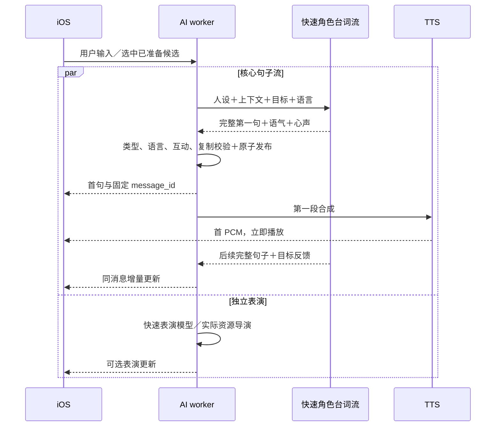

# 青柠持续慢回复：句子流水线与手机预取

## 第二次真实排查

20:19～20:20 的云端记录证实上轮仅减少并发争抢的修复不够。三个 `prepare:quick` 均失败，后台分别花 7.09、7.36、7.49 秒，没有完整缓存可消费。快速 Character 模型把心声阶段写成自由文本、输出根级 asides、输出非法字段；严格整份规划校验导致重试并整体失败。普通请求仍在完整模型 JSON 返回后才调用 TTS，20:20:09 首 PCM 5.123 秒。

客户端有另一问题：三条建议文字出现后就结束状态查询，不再查询它们的回复 PCM；建议可见不等于回答音频已准备好，更不等于手机已有音频。原始追踪与检查只存忽略的 `.local/logs/lime-new-*`，不公开真实对话和账户。

## 架构变化

- 新 `streaming_core` 开关可回退原完整规划链路；普通和预生成都用相同句子流水线。使用可配置 `streaming_model`（默认 `qwen-turbo`）和厂商 JSON mode SSE，根对象先输出 beats 数组；每个完整 beat 到达即交付，不等待根对象后面的目标反馈。不用字符串正则拼补台词，不使用本地固定回复。
- 合法第一句无需等待第二句、完整控制字段、目标提交、表演。每个完整句子通过语言、互动种类和账户级逐字/近似复制检查后，才公布或送入 TTS。非法可选心声/语气字段保守过滤，不要求角色模型付费重写整句话。
- 固定 message_id 持续更新同一消息与重复检索索引；更新前排除自身进行原子复制检查。已播出的正确第一句不会因可选尾部字段失败被删掉或盲目重新生成。网络/取消只记录可能已经计费的调用，不自动重发。
- 保留角色原有的完整设定、语言、偏好、真实历史和目标分支；目标反馈只在有用户原文依据时生效。音频先交付，反馈在本轮后续同请求幂等提交，不增加一条虚假的用户/AI 消息。
- 心声仍编译成非朗读部分，位于自然句子边界；TTS 只接真实台词。后续句子的消息更新同步刷新客户端揭示状态；可选表演继续用角色真实能力目录，独立任务失败不使已接受台词失败。
- 客户端等核心生成完成后才开始基于最终文本的下一轮预测，避免用半句上下文反复启动并取消后台调用；此时当前语音可能仍在播放，可以继续后台准备。
- 准备状态与建议状态可返回本账号、同角色、同上下文的完整 PCM。按 id 跳过已取的片段，单次原始 PCM 上限 4 MiB；没有消费候选、写聊天或发起付费调用。其他账户、失效上下文均取不到。手机以原消息/beat 键写持久语音缓存。
- 建议出现后继续跟进后台准备。选中已就绪候选由服务器正式消费与登记，客户端取得确认后使用已有本地 PCM 播放，跳过重复网络音频的播放，保留服务器状态同步。不能把“仍在生成”伪装为“完整缓存”。

目标是非缓存约 1 秒首播、完整缓存 500 ms 内首播；网络、厂商首 token、TTS 首包与 iOS 首输出必须分别实测，不能以本机模拟的 1 ms 缓存读取冒充全链路达标。

## 验证

新增无付费测试覆盖：分块 Unicode/转义解析、合法台词不受可选字段错误影响、第一段 PCM 不等待后续句子/控制对象、消息幂等与索引更新、私有完整 PCM 预取及失效上下文隔离。完整测试 266 passed / 4 skipped（无付费）。第一版尝试让 Character 模型输出多个 JSON 对象，经限量真实验证出现非法 JSON，未激活该发布；改用通用快速模型的单根 JSON mode，保持逐个完整 beat 解析。真实测量如下；部署结果完成后补记。

依据 [百炼流式输出文档](https://help.aliyun.com/en/model-studio/stream) 使用真实流，保留可核对的首 token、首句、首音频时间，不以响应头当作首音频。

完整缓存即使仍有可选表演任务也走完整候选领取，不重放生成中的早期事件。未完成候选继续单一任务接入，首句必须先于音频 started/chunk 交付；最终目标反馈到齐才幂等提交。中文本地 BGE 高置信度检查保留，流式增量检查排除本条消息自身；可选心声语言错误过滤，不重写正确台词。尾部可选 state 与用户事实记忆建议保留，记忆仍须用户确认才进入召回。

### 云端限量真实调用（隔离 draft）

青柠、真实角色设定与能力、英文练习目标，synthetic owner、不写真实用户聊天。JSON mode 一轮共三个付费 HTTP 调用（台词＋并行表演＋TTS）：

| 阶段 | 实测 |
|---|---:|
| 首 token | 361.092 ms |
| 首句交付 | 827.415 ms |
| 核心生成完成 | 1,201.378 ms |
| 服务端首 PCM | 1,397.807 ms |
| 全部生成／传输完成 | 2,124.372 ms |
| 同 PCM 服务端缓存首包（不调用模型） | 1.070 ms |

这是 worker 时间，未包含手机到服务器网络、音频硬件与实际扬声器首输出。非缓存约 1 秒目标尚未达标，完整缓存手机端 500 ms 也不能以这张表宣称达标。首句 827 ms 后 TTS 首包还需约 570 ms；流式路径已去掉等待完整规划的门槛，剩余瓶颈须与供应商首 token/TTS、手机真实首输出区分。不得把整个语音下载／播放时长当作首播延迟。

第二次完整实现真实验证仍只用三个 HTTP 调用：首 token 350.993 ms、首句 792.502 ms、核心完成 1,213.578 ms、首 PCM 1,045.961 ms、全部流完成 1,328.525 ms；复用完整 PCM 首包 1.143 ms。两次成功样本服务端冷首包约 1.05～1.40 秒，样本不足以代表 P95，也不含手机路径。最终追加修正防止生成中候选提前/重复应用本地 state 与关系反馈；初始事件仅登记台词，完整元数据才提交、补缓存。

开发者检查新增真实流式请求预览，和 provider 共用构造函数；旧规划预览标明是非流式回退。完整执行规则包含 stream_wire 与 streaming_reply，查看不调用付费模型。

### 手机后的追加检查

客户端安装及启动已成功。真实青柠完整缓存接话首输出 436.26 ms；另一次重启缓存问候 1,491.76 ms，额外 register_opening 562.21 ms。这说明完整缓存也可能被旁路初始化阻塞。客户端持久化已确认的初始问候并合并并发登记，重置后清除确认。

未缓存的下一条接话在两次内部重复检查后失败。流式提示词不再把旧台词重复堆入避免语料（保留真实历史），第一段必须直接给具体新内容；重试显式带前一次未交付草稿的私有修订约束。新增无付费回归证明未交付复制不播出、后一次收到修订并正常交付。去重比较是纯函数，增加有界 2,048 项 LRU 并去掉 FTS/最近列表重复比较，不改变相似度门槛或账户检索授权。不能以单个 436 ms 手机样本宣布所有缓存场景达标。
